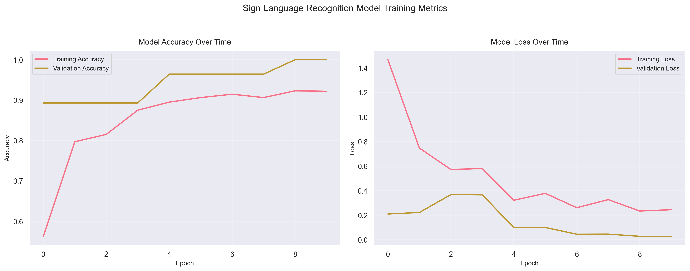

# Sign Language Interpreter

A real-time sign language recognition system using computer vision and deep learning. This project can recognize American Sign Language (ASL) gestures from live video feed and translate them into text.

## Features

- Real-time sign language recognition from webcam feed
- Support for 29 ASL gestures (26 letters + 3 special gestures)
- Hand detection and tracking
- Data augmentation for improved model training
- Training visualization with accuracy and loss charts
- Optimized model architecture for fast inference

## Project Structure

```
Sign/
├── data/
│   ├── train/          # Training images organized by class
│   └── test/           # Test images organized by class
├── main.py             # Main application for real-time recognition
├── model.py            # Model architecture definition
├── train.py            # Training script
├── plot_training.py    # Script to visualize training metrics
├── set_hand_histogram.py  # Hand detection setup
├── create_gestures.py  # Data collection script
├── rotate_images.py    # Data augmentation script
├── display_gestures.py # Dataset visualization
├── organize_test.py    # Test data organization script
├── requirements.txt    # Project dependencies
└── README.md          # Project documentation
```

## Requirements

- Python 3.8+
- OpenCV
- TensorFlow
- NumPy
- Matplotlib
- Other dependencies listed in `requirements.txt`

## Installation

1. Clone the repository:
```bash
git clone https://github.com/yourusername/Sign.git
cd Sign
```

2. Install dependencies:
```bash
pip install -r requirements.txt
```

## Usage

### 1. Data Collection and Preparation

To collect training data:
```bash
python set_hand_histogram.py  # Set up hand detection
python create_gestures.py     # Collect gesture data
python rotate_images.py       # Augment the dataset
```

### 2. Model Training

Train the model:
```bash
python train.py
```

View training metrics:
```bash
python plot_training.py
```

### 3. Real-time Recognition

Run the main application:
```bash
python main.py
```

## Model Architecture

The model uses a CNN architecture optimized for real-time performance:
- Input: 32x32 RGB images
- 4 Convolutional blocks with BatchNormalization
- MaxPooling layers for dimensionality reduction
- Dense layers with Dropout for classification
- Output: 29 classes (ASL gestures)

## Training Process

- Image size: 32x32 pixels
- Batch size: 64
- Data augmentation: rotation, shift, shear, zoom, flip
- Early stopping and learning rate reduction
- Model checkpointing for best weights

## Training Metrics

The training process is monitored through various metrics that help understand the model's learning progress:

### Accuracy and Loss Plots



The plots above show:
- **Training vs Validation Accuracy**: Shows how well the model learns and generalizes. In your latest run, the model achieved:
  - Training Accuracy: **92.19%**
  - Validation Accuracy: **100%**
- **Training vs Validation Loss**: Indicates the model's convergence. In your latest run:
  - Training Loss: **0.2452**
  - Validation Loss: **0.0283**
- **Learning Rate**: Shows how the learning rate adapts during training (if available)

#### Interpretation
- The model achieves very high accuracy on both training and validation sets, with validation accuracy reaching 100% and very low validation loss. This suggests the model is highly effective on the current validation set. If your validation set is small, consider expanding it for a more robust evaluation.
- The plots help you visually track overfitting, underfitting, and convergence during training.

## Performance

- Training time: ~15-30 minutes
- Real-time inference: ~30 FPS
- Accuracy: Varies based on lighting conditions and hand positioning

## Contributing

Contributions are welcome! Please feel free to submit a Pull Request.

## License

This project is licensed under the MIT License - see the LICENSE file for details. 